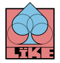

# LÏKE2D

  

Want to make a 2D browser game? Well like, do it!

LIKE is in the same family as LÖVE or Raylib, but only for web.
2D gamedev has never been simpler!

## Simple bindings

No need to fuss with clunky web APIs.
Get things on screen in an instant.

## Good practices

By using low-state abstractions, LIKE
is much easier to reason about than Vanilla.

## Build how you want to

LIKE is a framework, not an engine.
It's almost like: imagine if Vanilla gamedev was good.

## Open-Source and compact

LIKE is under the GPLv2, so you're free to modify it as you see fit.
The code base is intentionally kept as small and simple as possible, so you can work on it too.

## Ready to go?

[Read more and get started](https://github.com/44100hertz/Like2D/tree/master/packages/like2d)
